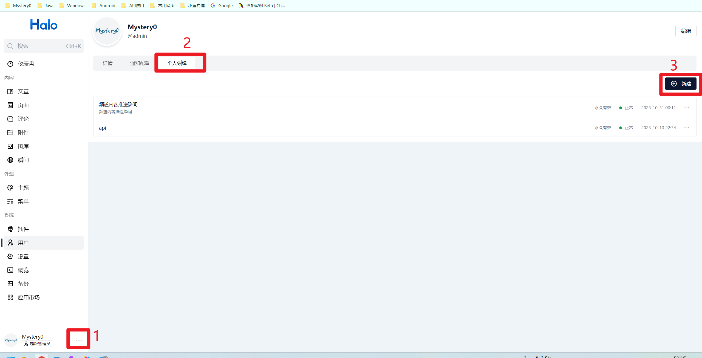
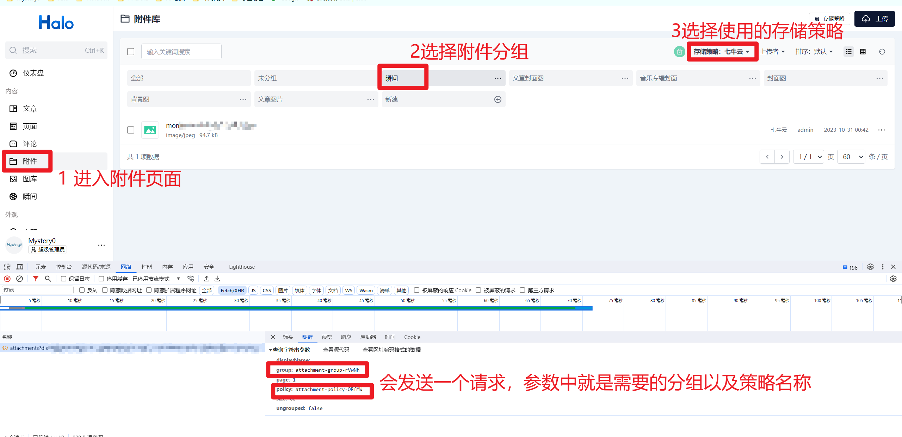

# telegram-channel-publisher

将Telegram频道的内容发布到其他地方，例如Halo的瞬间


示例：

telegram频道： [Mystery0的随缘日常](https://t.me/Mystery0Channel)

Halo站点： [瞬间 - Mystery0の小站](https://blog.mystery0.vip/moments)

## 使用方法

```shell
docker run -d \
    -e CONFIG_HOME=/app/etc \
    -v /path/to/logs:/app/logs \
    -v /path/to/config.yaml:/app/etc/config.yaml \
    mystery0/telegram-channel-publisher:latest
```

`/app/logs` 是运行时的日志目录，如果出现无法启动的情况，建议单独挂载出来，方便查看日志。

`/app/etc` 是配置文件目录，对应环境变量 `CONFIG_HOME`

环境变量是指定服务使用的配置文件的目录，配置文件的名称必须是`config.yaml`，如果运行时找不到配置文件，会报错退出。

## 配置文件

```yaml
bot:
  # 机器人的token
  token: "XXXXXXXXXXXXXXXXXXXX"
  # 机器人的接入点信息，如果部署的服务器无法访问Telegram，可以使用代理的形式来访问
  endpoint: ""
  channel:
    # 是否启用频道消息的处理
    enable: true
    # 指定频道id，如果指定，那么只有对应频道的消息才会被处理，如果不指定，那么所有频道的消息都会被处理
    id: ""
    # 需要过滤的频道消息，这里可以填上对应的标签，例如：["tag1", "tag2"]，那么就会过滤任何包含 “#tag1”、“#tag2” 的消息
    filter: []
  private:
    # 是否启用私聊消息的处理
    enable: true
    # 指定用户id，如果指定，那么只有对应用户的消息才会被处理，如果不指定，那么所有用户的消息都会被处理
    sender: ""

log:
  home: "logs"
  file: "publisher.log"
  color: false
  local: false
  # 调试模式，出现问题的时候建议打开，会输出更多的日志信息
  debug: true

publisher:
  # 发布的类型，目前只支持log和halo，log是将内容输出到日志文件，halo是将内容发布到Halo的瞬间
  type: "halo"

halo:
  # Halo的访问域名
  host: "https://blog.mystery0.vip"
  # Halo的token 参考下图进行创建
  token: "pat_XXXXXXXX"
  image:
    # 消息中的图片的分组信息，最好是在管理后台自己创建一个分组专门放瞬间的图片，方便管理，可为空
    group: "attachment-group-XXXXXXXX"
    # 消息中的图片的存储策略，参考后续内容进行获取
    policy: "attachment-policy-XXXXXXXX"
```

### 创建Halo的token



创建令牌的时候，需要授予的权限如下：

- 附件查看：查询附件的信息以获取图片地址
- 附件管理：上传图片需要这个权限
- 瞬间管理：发布瞬间需要这个权限
- 瞬间查看：瞬间管理会默认授予这个权限

### 获取Halo的图片存储策略



# TODO
- [x] 支持对bot私聊
- [ ] 多张图片合起来发送瞬间
- [ ] 支持内容中包含emoji表情

# FAQ

1. 为什么图片这么糊？

> 目前已经是获取 Telegram 给的最高分辨率的图了，bot api似乎没给原图的接口，如果有，欢迎提issue告诉我

2. Emoji表情不支持吗？解析错位了

> Emoji表情在 Telegram 的预解析中所占长度与 Go 获取的不一致，因此会出现emoji表情后的所有内容都错位的情况，目前还没找到解决方案，如果有，欢迎提issue告诉我

3. 遇到了其他的问题？

> 欢迎提issue告诉我